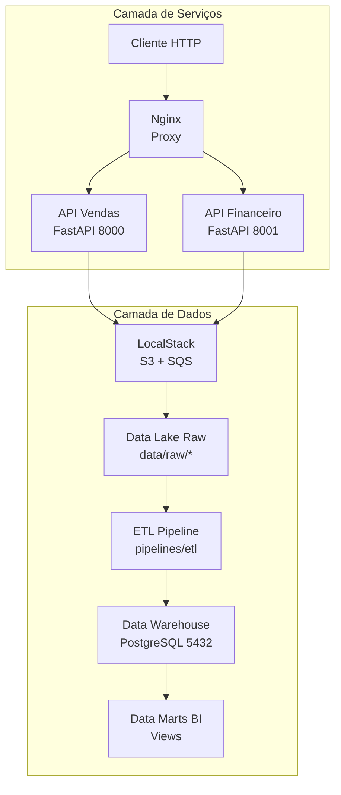
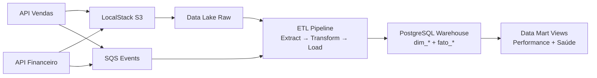
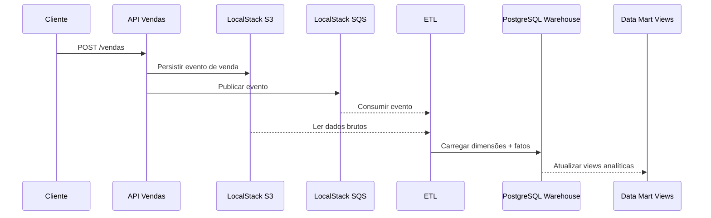
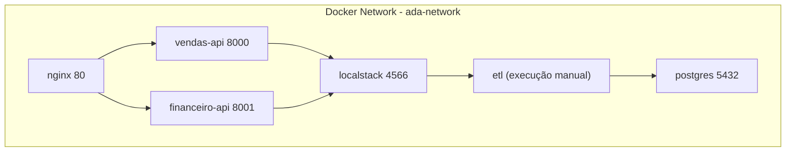
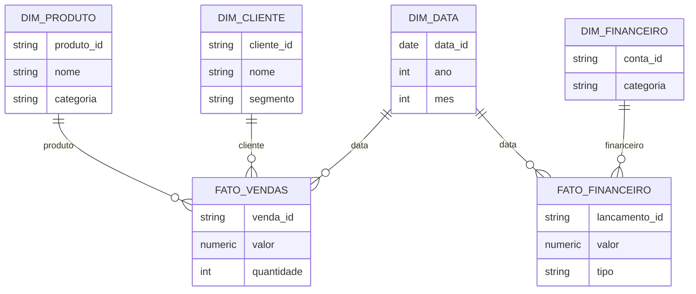

# Relatório Técnico — Scale-to-Insight

## 1. Executivo (Resumo)

O projeto **Scale-to-Insight** materializa a migração de um e-commerce monolítico para um ecossistema de dados moderno e escalável. A solução integra uma camada operacional, responsável por processar vendas e análises financeiras em tempo real, e uma camada analítica, dedicada à consolidação, governança e consumo de dados para BI. O objetivo central é sustentar picos de tráfego, preservar o histórico transacional e habilitar inteligência de negócio contínua para a área financeira.

No escopo entregue, foram implantados serviços desacoplados para Vendas e Financeiro, um proxy reverso para centralizar o tráfego, simulação de cloud com LocalStack, pipeline ETL em Python e um Data Warehouse em PostgreSQL com modelo Star Schema, além de Data Marts para consumo analítico.

## 2. Arquitetura Geral

A arquitetura está organizada em camadas bem definidas, garantindo separação de responsabilidades e clareza no fluxo ponta a ponta. A camada de serviços atende às requisições HTTP e gera os eventos operacionais; a camada de infraestrutura simula serviços cloud; a camada de processamento orquestra o ETL; a camada de armazenamento consolida dados brutos e tratados; e a camada de análise entrega informações para BI.

### Diagrama de Atores e Componentes (Mermaid)

### Fluxo de Dados Completo (Mermaid)

O fluxo inicia nas APIs operacionais, que persistem eventos de vendas e finanças no LocalStack (S3 + SQS). Os dados brutos são armazenados no Data Lake (camada raw) e, em seguida, o pipeline ETL executa extração, transformação e carga para o PostgreSQL. Por fim, as views analíticas materializam os Data Marts consumidos pelas ferramentas de BI.

## 3. Decisões Arquiteturais Detalhadas

### 3.1 FastAPI vs Flask

A decisão por FastAPI foi motivada pela necessidade de alto desempenho, documentação automática e validação estrita de payloads. Embora Flask seja simples e popular, ele exigiria mais trabalho para validação, documentação e suporte a async. FastAPI oferece Pydantic e OpenAPI nativamente, reduzindo esforço de desenvolvimento e aumentando a confiabilidade do contrato das APIs. O trade-off é uma curva de aprendizado ligeiramente maior, compensada pelo ganho de produtividade e performance.

### 3.2 PostgreSQL como Data Warehouse

O PostgreSQL foi escolhido como Data Warehouse pela aderência a propriedades ACID, forte suporte a views e boa compatibilidade com o modelo Star Schema. Alternativas cloud poderiam oferecer elasticidade, porém com custos adicionais e maior complexidade. A decisão privilegia a robustez e o baixo custo, com impacto direto na consistência das consultas analíticas.

### 3.3 LocalStack vs Cloud Real (AWS)

A simulação de serviços cloud com LocalStack garante um ambiente local reproduzível, sem custos e fácil de versionar. Embora não replique 100% da AWS real, é suficiente para o escopo acadêmico e acelera a entrega. O trade-off é a eventual necessidade de ajustes ao migrar para cloud real, mas o benefício imediato é a simplicidade do desenvolvimento local.

### 3.4 Python Scripts + Airflow DAGs

O pipeline ETL foi estruturado com scripts Python para execução manual e, adicionalmente, preparado para orquestração via DAGs do Airflow. Isso equilibra simplicidade no desenvolvimento e escalabilidade no futuro. A manutenção de dois artefatos pode gerar overhead, mas garante flexibilidade para ambientes distintos (local vs produção).

### 3.5 Star Schema

O Star Schema foi adotado por sua eficiência em consultas analíticas e pela simplificação de joins. Embora introduza redundância, ele é amplamente aceito por ferramentas de BI e permite consultas rápidas e intuitivas. Esse modelo atende diretamente aos requisitos de Data Mart de performance de vendas e saúde financeira.

### 3.6 Nginx como Proxy Reverso

O Nginx foi escolhido por sua leveza e capacidade de atuar como ponto de entrada único, simplificando o roteamento entre serviços e habilitando balanceamento de carga. A alternativa seria um API Gateway completo, porém isso aumentaria a complexidade sem ganhos proporcionais no contexto do projeto. O impacto é uma arquitetura mais simples e pronta para escalar horizontalmente.

### 3.7 Docker Compose para Orquestração Local

O Docker Compose oferece reprodutibilidade e simplicidade no provisionamento do ambiente local, atendendo plenamente ao requisito de entrega. Kubernetes foi considerado, mas seria excessivo para o escopo atual. Assim, o Compose viabiliza onboarding rápido e garante previsibilidade na execução do projeto.

## 4. Componentes e Responsabilidades

| Componente | Tecnologia | Porta | Função |
|---|---|---|---|
| Proxy Reverso | Nginx | 80 | Entry point, load balancing |
| API Vendas | FastAPI | 8000 | CRUD vendas, eventos |
| API Financeiro | FastAPI | 8001 | Análise financeira, relatórios |
| Cloud Simulation | LocalStack | 4566 | S3 + SQS simulados |
| ETL | Python | N/A | Extract, Transform, Load |
| Data Warehouse | PostgreSQL | 5432 | Star Schema, dimensões e fatos |
| Data Marts | SQL Views | N/A | Performance Vendas, Saúde Financeira |

## 5. Diagrama Técnico Detalhado

### 5.1 Diagrama de Sequência (Venda → Data Mart) — Mermaid

O evento de venda é recebido pela API de Vendas, persistido no S3 (LocalStack) e enfileirado no SQS. Em seguida, o ETL processa o dado bruto, transforma-o em dimensões e fatos, e o carrega no PostgreSQL. Por fim, as views do Data Mart disponibilizam a métrica para BI.

### 5.2 Diagrama de Deployment (Docker) — Mermaid

### 5.3 Diagrama de Dados (Star Schema) — Mermaid

## 6. Padrões e Princípios Aplicados

A solução segue princípios de microserviços, API-first e stateless para facilitar escalabilidade e manutenção. O padrão ELT garante preservação do dado bruto, enquanto o uso de ACID no warehouse assegura consistência analítica. O isolamento por redes Docker contribui para a segurança e para o controle do ambiente.

## 7. Escalabilidade

O Nginx permite distribuição de carga entre múltiplas instâncias de APIs, preparando o caminho para escalabilidade horizontal. O Data Lake suporta crescimento histórico, enquanto o uso de views e possível materialização aceleram consultas analíticas. A arquitetura também permite particionamento futuro das tabelas de fatos, reduzindo custos de consulta.

## 8. Segurança e Boas Práticas

As credenciais são tratadas via variáveis de ambiente, evitando hardcoding. A validação dos payloads é feita com Pydantic, reduzindo risco de inconsistências. Health checks e redes isoladas reforçam a robustez operacional do ambiente.

## 9. CI/CD e Automação

O repositório define pipelines para build, testes e deploy local. Esses workflows garantem que imagens Docker sejam geradas corretamente, que schemas e testes sejam validados e que o ambiente possa ser provisionado de forma previsível.

## 10. Conclusões

A solução atende integralmente aos requisitos do Projeto Final, entregando uma arquitetura moderna, escalável e bem documentada. A separação de serviços, a integração com pipelines de dados e o modelo analítico em Star Schema mostram aderência às boas práticas de engenharia de dados e software. Como evolução, recomenda-se migrar o LocalStack para serviços cloud reais, orquestrar ETLs com Airflow completo e incorporar observabilidade para monitoramento contínuo.
